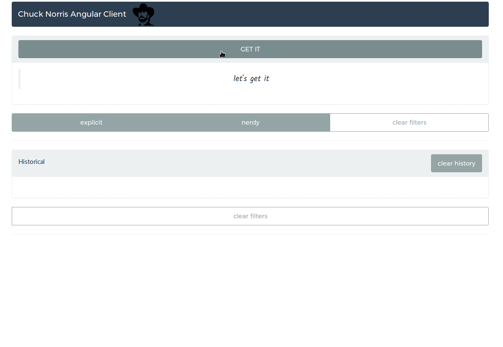

# Chuck-norris-angular-client

A modern approatch to AngularJS 1.6 architecture presenting a simple client for a Chuck Norris' API.

## Try live!
[https://adrianabreu.github.io/chuck-norris-angular-client/#/sentence](https://adrianabreu.github.io/chuck-norris-angular-client/#/sentence)

## Stack used

* Angular 1.6
* Webpack 2
* Sass
* Typescript 2.4.2
* Yarn
* Awesome-typescript-loader

## Angular archetype

This app is built on the latest standars, using components approach. Thanks to [angular-ts-decorators](https://github.com/vsternbach/angular-ts-decorators) the application is really similar to Angular(2+) structure making easier to migrate it.

This application uses:
* uirouter
* ngstorage
* lodash
* angular-resource 

## Architecture importance

Also, this architecture gives you a better code structure that get the benefits from Typescript even when some parts of the application keep the old codebase.
