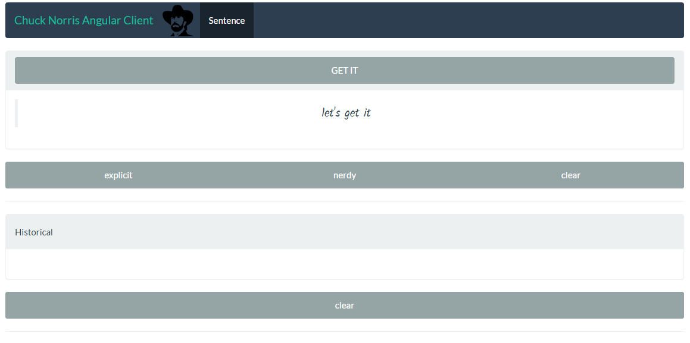
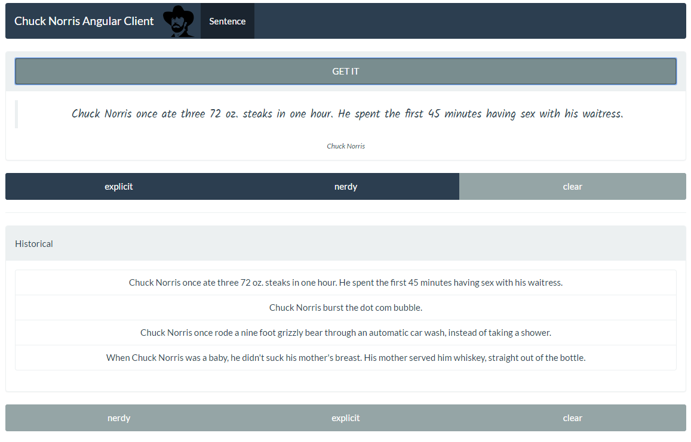

## Angular-chuck-api

A client for Chuck Norris' API made in AngularJS & Webpack.

### Try live!

[https://aabreuglez.github.io/chuck-norris-angular-client/](https://aabreuglez.github.io/chuck-norris-angular-client/)

### Screenshots




### Tasks:

1. Grab a sentence [Done]
2. Apply static filters [Done] 
3. Grab filters [Done]
4. Apply filters dynamic [Done]
5. Make routing /sentence [Done]
6. Create historical component [Done]
7. Create historical filters [Done]
8. Apply filter on historical (refactor old filters) [Done]
9. Manage cache [Need to add a button for cleaning cache]


### Extra packages added

```
npm install --save angular-resource
npm install --save angular-route
npm install --save bootstrap 
npm install --save lodash
npm install --save ngstorage
```